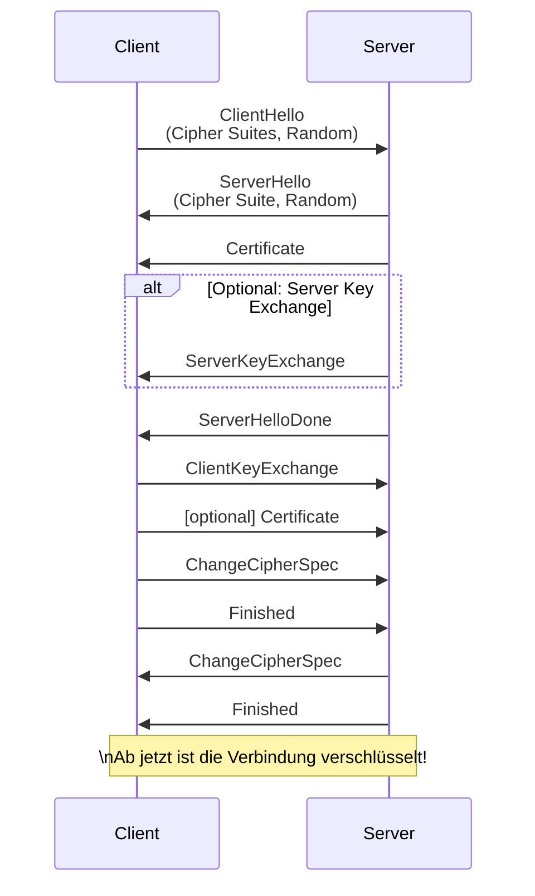
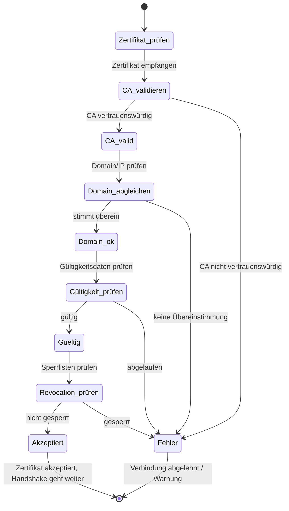
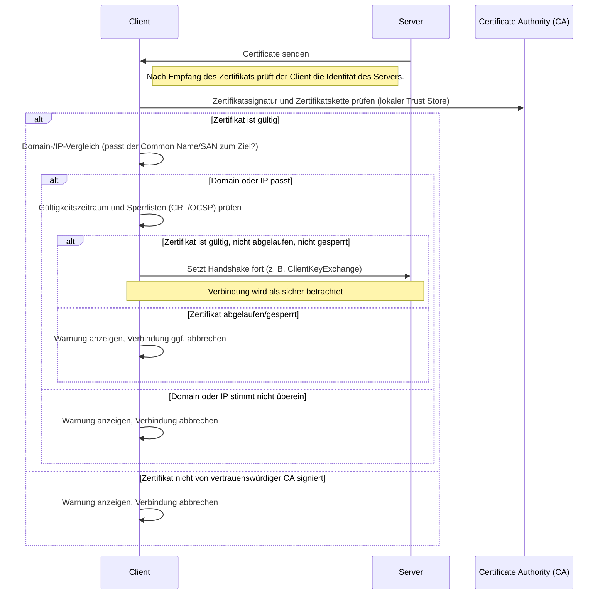

# TLS & HTTPS

**Transport Layer Security** ist ein kryptografisches Protokoll, das sichere Kommunikation über unsichere Netzwerke wie dem Internet ermöglicht. Es schützt Daten vor Abhören und Manipulation, indem es Verbindungen zwischen Clients und Servern verschlüsselt. TLS ist der Nachfolger von SSL (Secure Sockets Layer) und wird kontinuierlich weiterentwickelt, um neuen Bedrohungen zu begegnen.

Ein TLS-Handshake läuft ab, bevor die eigentlichen Nutzdaten übertragen werden. Dabei werden kryptografische Parameter ausgehandelt, Zertifikate geprüft und Sitzungsschlüssel erzeugt. Diese Schlüssel ermöglichen die symmetrische Verschlüsselung der übertragenen Daten, wodurch Performance und Sicherheit kombiniert werden.

TLS kann grundsätzlich jede Protokollkommunikation absichern, z. B. E-Mail, Dateitransfer oder Chat.

**Verwandte Protokolle mit TLS-ähnlichen Verfahren:**
- **FTPS**: FTP über TLS (Dateitransfer)
- **IMAPS/SMTPS/POP3S**: E-Mail-Protokolle mit TLS-Verschlüsselung
- **LDAPS**: LDAP-Verzeichnisdienste über TLS
- **XMPP/Jabber**: Chatprotokolle mit TLS-Schutz 
- **HTTPS**: HTTP über TLS (Webkommunikation)


## Verschlüsselung

Die Nutzung von HTTPS (Hypertext Transfer Protocol Secure) ist heute nicht nur für die Verbindung zwischen Browser und Webserver essenziell, sondern gewinnt auch in modernen IT-Architekturen, etwa bei der Kommunikation zwischen Microservices, zunehmend an Bedeutung. Ohne HTTPS werden sämtliche übertragenen Daten im Klartext übermittelt und können von Dritten abgefangen, manipuliert oder missbraucht werden. Das betrifft nicht nur Passwörter und Zahlungsdaten, sondern auch interne APIs, Sitzungs-Token oder sensible Unternehmensinformationen.

Gerade in Microservice-Architekturen, bei denen viele Dienste untereinander kommunizieren – oft verteilt über mehrere Rechenzentren oder Cloud-Umgebungen ist der Schutz der Verbindungen essenziell. Angriffe wie Man-in-the-Middle, Replay-Attacken oder das unbefugte Auslesen von Authentifizierungsinformationen lassen sich durch HTTPS und TLS wirksam verhindern. Zusätzlich gewährleistet HTTPS nicht nur Vertraulichkeit und Integrität, sondern auch Authentizität, da jeder Dienst sein Gegenüber anhand von Zertifikaten eindeutig identifizieren kann.

**Wichtige Gründe für HTTPS:**

* Schutz vor Abhören und Manipulation (z. B. durch Insider oder Angreifer im Netzwerk)
* Sicherstellung der Integrität aller übertragenen Daten
* Authentifizierung der Kommunikationspartner mittels Zertifikaten
* Vermeidung von Session-Hijacking und Credential-Leaks bei API-Calls
* Einhaltung gesetzlicher und regulatorischer Anforderungen (z. B. DSGVO)

Gerade im Kontext von Cloud, DevOps und Microservices ist HTTPS der Sicherheits-Standard für jede Art von Netzwerkkommunikation.

## TLS-Handschlag



### 1. Auswahl der Cipher Suite

* Der **Client** sendet zu Beginn (im `ClientHello`) eine Liste aller Cipher Suites, die er unterstützt.
* Der **Server** wählt aus dieser Liste die Cipher Suite aus, die beide Parteien unterstützen und die er bevorzugt (oft die sicherste Option).
* Die ausgewählte Cipher Suite wird im `ServerHello` an den Client zurückgemeldet.
* Diese Suite legt die genutzten Algorithmen für Schlüsselaustausch, Authentifizierung, Verschlüsselung und Integritätsprüfung fest.

**Beispiel einer Cipher Suite:**

```
TLS_ECDHE_RSA_WITH_AES_256_GCM_SHA384
```

* ECDHE: Schlüsselaustausch (Forward Secrecy)
* RSA: Authentifizierung
* AES\_256\_GCM: Verschlüsselung
* SHA384: Integritätsprüfung

---

### 2. Austausch der Zufallszahlen (Random Numbers)

* Der **Client** sendet mit dem `ClientHello` eine zufällig generierte Zahl (Client Random),
  der **Server** mit dem `ServerHello` ebenfalls eine eigene Zufallszahl (Server Random).
* Beide Zufallszahlen werden **unverschlüsselt** übertragen.
* Die Randoms dienen der Frische und Einzigartigkeit jeder TLS-Session und werden später zur Berechnung des gemeinsamen Sitzungsschlüssels genutzt.
* Die Sicherheit der Verbindung hängt nicht von der Geheimhaltung der Randoms ab, sondern vom gewählten Schlüsselaustauschverfahren (z. B. Diffie-Hellman).

---

### 3. Das „Certificate“ im TLS-Handshake

Im TLS-Handshake sendet der Server dem Client ein **digitales Zertifikat** („Certificate“), um seine Identität zu belegen und dem Client zu zeigen, dass er tatsächlich der gewünschte Kommunikationspartner ist. Dieser Schritt ist ein zentrales Element der Authentifizierung im HTTPS-Protokoll.

**Warum sendet der Server ein Zertifikat?**
- Der Client muss sicherstellen, dass er mit dem „echten“ Server spricht und nicht mit einem Angreifer („Man-in-the-Middle“).
- Das Zertifikat enthält den öffentlichen Schlüssel des Servers und eine Bestätigung durch eine vertrauenswürdige Zertifizierungsstelle (CA), dass der Schlüssel tatsächlich zu dieser Domain gehört.
- Der Client prüft das Zertifikat mit Hilfe seines lokalen Zertifikatsspeichers („Trust Store“) und validiert damit die Identität des Servers.

**Wie wird das Zertifikat übermittelt?**
- Im TLS-Handshake sendet der Server das Zertifikat als Teil der `Certificate`-Nachricht unverschlüsselt, aber direkt nach dem Aufbau der TCP-Verbindung.
- Das Zertifikat ist eine digital signierte Datei und enthält kryptografische Informationen, die der Client zur Verifizierung nutzen kann.

**Was ist im Zertifikat enthalten?**
- Öffentlicher Schlüssel des Servers
- Name und Domain des Servers (Subject)
- Name der ausstellenden Zertifizierungsstelle (Issuer)
- Gültigkeitszeitraum (Start- und Enddatum)
- Digitale Signatur der CA
- (Optional) Erweiterungen, z. B. für alternative Namen oder Einsatzzwecke

> Das Server-Zertifikat bildet die Grundlage für das Vertrauen und die Sicherheit jeder HTTPS-Verbindung.

#### Was passiert, wenn der Server keinen Domain-Namen hat und nur über die IP-Adresse kommuniziert?

Im TLS-Standard ist vorgesehen, dass der Server seine Identität mit einem Zertifikat belegt. Typischerweise wird darin die **Domain** als „Common Name“ (CN) oder als „Subject Alternative Name“ (SAN) eingetragen.  
Wenn jedoch **nur eine IP-Adresse** verwendet wird (kein DNS-Name), entstehen besondere Herausforderungen:

**Was passiert konkret?**
- Zertifikate von öffentlichen Zertifizierungsstellen (CAs) werden normalerweise **nicht für reine IP-Adressen** ausgestellt – vor allem nicht für öffentliche IPs. 
- Einige CAs können Zertifikate für private IPs ausstellen, das ist aber selten und eingeschränkt.
- Ein Zertifikat *kann* eine IP-Adresse im SAN-Feld enthalten, dann prüft der Client bei der Verbindung, ob die IP im Zertifikat steht.
- Wenn keine Übereinstimmung (z. B. keine IP im Zertifikat) vorliegt, schlägt die Verifikation fehl und Browser/Clients zeigen eine Warnung oder verweigern die Verbindung.

**Was sind die Konsequenzen?**
- Die Verbindung ist unsicher oder zumindest nicht „trusted“ (rot in der Adressleiste).
- Für interne Systeme oder Testzwecke werden daher häufig **self-signed certificates** verwendet oder Zertifikate mit passenden IP-SANs ausgestellt (Clients müssen dann das CA-Zertifikat selbst als vertrauenswürdig markieren).

**Kurz:**  
TLS kann technisch auch mit IP-Adressen arbeiten, aber für echte Vertrauenskette und „grünes Schloss“ ist fast immer ein Domain-Name nötig.

**Wichtige Hinweise:**
- Im Internet produktiv immer auf Domainnamen und gültige Zertifikate setzen!
- Für private Umgebungen können IP-basierte Zertifikate genutzt werden – dann muss der Trust im Client explizit eingerichtet werden.

#### Prüfen des Certificates aus Client Sicht





### Was sind CRL und OCSP?

Wenn ein Zertifikat kompromittiert, abgelaufen oder aus anderen Gründen ungültig wird, muss der Client überprüfen können, ob das vom Server präsentierte Zertifikat **gesperrt** ist. Dafür gibt es zwei zentrale Mechanismen:

**CRL (Certificate Revocation List):**
- Eine CRL ist eine vom Herausgeber (CA) regelmäßig veröffentlichte, digitale Sperrliste.
- Sie enthält alle Seriennummern von Zertifikaten, die vor ihrem Ablauf für ungültig erklärt wurden.
- Der Client lädt die (mitunter große) Liste herunter und prüft, ob das Server-Zertifikat darin gelistet ist.

**OCSP (Online Certificate Status Protocol):**
- OCSP ist ein Online-Dienst zur schnellen Einzelabfrage des Sperrstatus eines Zertifikats.
- Der Client fragt einen OCSP-Responder der CA direkt: „Ist dieses Zertifikat gültig?“ und erhält die Antwort in Echtzeit.
- Effizienter und aktueller als CRL, da nur der Status eines einzelnen Zertifikats abgefragt wird.

**Wozu dienen CRL/OCSP?**
- Beide Verfahren helfen, abgelaufene, kompromittierte oder zurückgezogene Zertifikate zu erkennen und Verbindungen mit diesen zu verhindern.
- Moderne Browser und Clients bevorzugen OCSP (oft in der Variante OCSP Stapling), können aber auch CRLs nutzen.

> Kurz: CRL und OCSP sind Mechanismen, um ungültige Zertifikate zu erkennen und damit die Sicherheit von TLS-Verbindungen weiter zu erhöhen.

### `ServerHelloDone` - Nächste Schritt des Clients

Nachdem der Server im TLS-Handshake seine „ServerHelloDone“-Nachricht gesendet hat, ist der Client an der Reihe und muss den sogenannten **ClientKeyExchange** senden.

#### Aufgabe des „ClientKeyExchange“

- Mit dieser Nachricht liefert der Client das Material, das für die spätere Berechnung des **gemeinsamen Sitzungsschlüssels** nötig ist.
- Wie genau das aussieht, hängt vom **gewählten Schlüsselaustauschverfahren** (aus der Cipher Suite!) ab.
- Bei reinem RSA-Schlüsselaustausch schickt der Client stattdessen den Sitzungsschlüssel (verschlüsselt mit dem Public Key des Servers).
- Bei modernen Cipher Suites kommt **(Elliptic Curve) Diffie-Hellman Ephemeral (DHE/ECDHE)** zum Einsatz.
  - Hier enthält „ClientKeyExchange“ den öffentlichen DH-Anteil des Clients. Gemeinsam mit dem Server-Anteil kann dann auf beiden Seiten der identische Sitzungsschlüssel berechnet werden (ohne dass dieser über das Netzwerk gesendet wird).

#### Bedeutung

- Erst durch diesen Austausch kann der **Session Key** entstehen, mit dem ab jetzt die gesamte Kommunikation verschlüsselt wird.
- Bei (EC)DHE entsteht auch „Forward Secrecy“: Der Schlüssel ist nur für diese eine Verbindung gültig und kann nicht nachträglich kompromittiert werden.


Der „ClientKeyExchange“ übermittelt je nach Verfahren die nötigen Schlüsselanteile (z. B. DH-Anteil des Clients), damit beide Seiten einen geheimen Sitzungsschlüssel berechnen können, ohne dass dieser jemals das Netzwerk verlässt.

### Diffie-Hellman bei TLS

Diffie-Hellman ist ein mathematisches Verfahren, das es zwei Kommunikationspartnern erlaubt, einen gemeinsamen geheimen Schlüssel über eine unsichere Verbindung auszuhandeln, ohne dass dieser jemals übertragen wird. Genau diese Eigenschaft ist für TLS von großer Bedeutung, weil dadurch nach Abschluss des Handshakes beide Seiten denselben Sitzungsschlüssel kennen, den ein Angreifer nicht mitlesen kann.

Im TLS-Protokoll gibt es verschiedene Varianten des Diffie-Hellman-Verfahrens:

* **DHE (Diffie-Hellman Ephemeral):**
  Temporäre, für jede Verbindung neu generierte Schlüsselpaare sorgen für Forward Secrecy.
* **ECDHE (Elliptic Curve Diffie-Hellman Ephemeral):**
  Moderne, effiziente Variante basierend auf elliptischen Kurven; heute Standard in TLS 1.2 und 1.3.

#### Einfaches Diffie-Hellman-Beispiel mit kleinen Zahlen

##### 1. Öffentliche Parameter festlegen
- Primzahl \( p = 11 \)
- Basis \( g = 7 \)

##### 2. Private Schlüssel wählen
- Alice wählt \( a = 3 \)
- Bob wählt \( b = 5 \)

##### 3. Öffentliche Schlüssel berechnen
- Alice berechnet: \( A = g^a \mod p = 7^3 \mod 11 = 343 \mod 11 = 2 \)
- Bob berechnet: \( B = g^b \mod p = 7^5 \mod 11 = 16807 \mod 11 = 4 \)

##### 4. Öffentliche Schlüssel austauschen
- Alice sendet \( A = 2 \) an Bob
- Bob sendet \( B = 4 \) an Alice

##### 5. Gemeinsamen geheimen Schlüssel berechnen
- Alice berechnet: \( K = B^a \mod p = 4^3 \mod 11 = 64 \mod 11 = 9 \)
- Bob berechnet: \( K = A^b \mod p = 2^5 \mod 11 = 32 \mod 11 = 9 \)

##### Ergebnis
- Beide erhalten denselben geheimen Schlüssel: \( K = 9 \)
- Dieser Schlüssel kann nun für die symmetrische Verschlüsselung der Kommunikation verwendet werden.

---

Neben Diffie-Hellman existieren auch andere Verfahren (z.B. RSA), doch DHE/ECDHE sind besonders beliebt wegen Forward Secrecy: Selbst wenn ein Angreifer später den privaten Schlüssel des Servers kennt, kann er alte Verbindungen nicht nachträglich entschlüsseln.

---
### Client sendet `ChangeCipherSpec`

Nachdem der Client seinen Schlüsselanteil (z. B. Diffie-Hellman-Anteil) übermittelt hat, folgt im TLS-Handshake die Nachricht `ChangeCipherSpec`.

**Was bedeutet das?**
- Mit `ChangeCipherSpec` teilt der Client dem Server mit:  
  **„Ab jetzt verschlüssele und entschlüssle ich alles mit dem neu ausgehandelten Sitzungsschlüssel.“**
- Es ist also ein „Umschalten“ vom bisherigen Klartextmodus auf den verschlüsselten Modus.

**Ablauf:**
1. **Handshake-Phase:** Alle bisherigen Nachrichten (z. B. ClientHello, ServerHello, Certificate etc.) laufen im Klartext, weil der gemeinsame Sitzungsschlüssel noch nicht feststeht.
2. **Schlüsselaustausch abgeschlossen:** Nach „ClientKeyExchange“ kennen beide Seiten den neuen, geheimen Schlüssel.
3. **`ChangeCipherSpec`:**  
   - Der Client sendet diese Nachricht, um den Übergang in die verschlüsselte Kommunikation zu signalisieren.
   - Ab sofort verschlüsselt er alle weiteren Handshake- und Anwendungsdaten mit dem neuen Schlüssel.
4. **Server sendet ebenfalls eine `ChangeCipherSpec`**, wenn er bereit ist, verschlüsselt zu arbeiten.

**Wichtig:**  
- Nach `ChangeCipherSpec` schickt jede Seite eine „Finished“-Nachricht (bereits verschlüsselt).  
- Ab diesem Punkt ist die Verbindung für alle weiteren Daten sicher verschlüsselt.

> Kurz: `ChangeCipherSpec` markiert den Start der Verschlüsselung und beendet die unsichere Phase des Handshakes.

### "Chain of Trust“ bei TLS

Die **Chain of Trust** („Vertrauenskette“) beschreibt das Vertrauensmodell bei digitalen Zertifikaten im TLS-Kontext.

**Was steckt dahinter?**
- Ein Server-Zertifikat wird meist nicht direkt von einer Root-CA, sondern oft von einer „Intermediate CA“ ausgestellt.
- Jede CA (Certificate Authority) unterschreibt die nächste Stufe in der Kette, bis ganz oben eine **Root CA** steht.
- Der Browser oder Client vertraut nur Zertifikaten, die letztlich auf eine im System als vertrauenswürdig hinterlegte Root CA zurückführbar sind.

**Wie funktioniert die Chain of Trust beim Verbindungsaufbau?**
1. **Server sendet seine Zertifikatskette**:  
   - Enthält das eigene Zertifikat und alle Intermediate-Zertifikate bis zur Root CA.
2. **Client prüft jedes Zertifikat in der Kette**:
   - Jede Signatur in der Kette muss von der darüberliegenden CA gültig signiert sein.
   - Am Ende muss die Root CA im lokalen Trust Store des Clients liegen.
3. **Nur wenn die Kette vollständig und gültig ist, wird dem Server vertraut.**

**Bullet-Points:**
- Vertrauenskette vom Serverzertifikat bis zur Root CA
- Root CAs sind im Betriebssystem/Browser als vertrauenswürdig gespeichert
- Jede Stufe der Kette wird kryptografisch signiert und geprüft
- Nur bei lückenloser, gültiger Chain wird die Verbindung als sicher anerkannt

> Die „Chain of Trust“ sorgt dafür, dass nicht jedem beliebigen Zertifikat vertraut wird, sondern nur solchen, die von einer vertrauenswürdigen Root-CA (direkt oder indirekt) signiert wurden.


## Zertifikate & Automatisierung

### Self-Signed Zertifikate

* Ein **self-signed certificate** (selbstsigniertes Zertifikat) wird vom Serverbetreiber selbst erzeugt und signiert, ohne dass eine unabhängige Zertifizierungsstelle (CA) beteiligt ist.
* Vorteile: Einfach zu erstellen, kostenlos, sofort verfügbar.
* Nachteile: Wird von Browsern/Clients nicht als vertrauenswürdig anerkannt (Warnmeldungen!), keine Vertrauenskette (Chain of Trust), nicht geeignet für öffentlich erreichbare Dienste.
* Typischer Einsatzzweck: Entwicklung, Testumgebungen, interne Systeme.

### CA-signierte Zertifikate

* Hier prüft und signiert eine **Certificate Authority (CA)** das Zertifikat, z. B. Let’s Encrypt, DigiCert oder Sectigo.
* Vorteile: Wird von allen modernen Browsern und Clients automatisch als vertrauenswürdig anerkannt (sofern die CA im Trust Store ist), bildet eine vollständige Chain of Trust.
* Nachteile: Je nach CA kostenpflichtig (Let’s Encrypt ist die kostenlose Ausnahme), ggf. administrativer Aufwand.
* Typischer Einsatzzweck: Produktive, öffentlich zugängliche Websites und Services.

---

## Let's Encrypt und Certbot

### Was ist Let’s Encrypt?

* Eine öffentliche, gemeinnützige Zertifizierungsstelle (CA), die **kostenlos** und vollautomatisch TLS-Zertifikate für jedermann ausstellt.
* Ziel: Das Web komplett verschlüsseln und HTTPS für alle zugänglich machen.
* Zertifikate sind 90 Tage gültig, können aber beliebig oft erneuert werden.

### Was ist Certbot?

* Certbot ist ein **Open-Source-Tool** zur Automatisierung der Zertifikatsbeantragung, -installation und -erneuerung bei Let’s Encrypt.
* Es kann Webserver wie Apache und Nginx direkt konfigurieren.
* Unterstützt verschiedene Authentifizierungsmethoden (HTTP, DNS, etc.).

---

## Zertifikat mit Certbot erstellen & automatische Erneuerung

### Prerequisites 

- **Eigene Domain:**  
  Eine registrierte Domain, auf die du DNS-Einträge setzen kannst (z. B. `example.com`).  
  Let’s Encrypt-Zertifikate können *nicht* für reine IP-Adressen ausgestellt werden!

- **Öffentlich erreichbarer Host:**  
  Ein Host (z. B. Linux-VM, Cloud-Server, Raspberry Pi) mit fester öffentlicher IP-Adresse, der aus dem Internet erreichbar ist.

- **DNS-Konfiguration:**  
  Ein A- oder AAAA-Record der eigenen Domain zeigt auf die öffentliche IP des Servers.

- **Root-/sudo-Zugang:**  
  Administrativer Zugriff auf den Server (root oder sudo), um Pakete zu installieren und Webserver zu konfigurieren.

- **Laufender Webserver:**  
  Apache oder Nginx sollten installiert und aktiv sein, da Certbot direkt mit ihnen interagieren kann.

- **Firewall-Konfiguration:**  
  Die Ports 80 (HTTP) und 443 (HTTPS) müssen von außen erreichbar sein (Einstellung in der Serverfirewall und ggf. Cloud-Firewall prüfen).

- **Aktualisierte Paketquellen:**  
  Das System sollte aktuell sein, damit Certbot und Abhängigkeiten installiert werden können (`sudo apt update && sudo apt upgrade`).

> Sind diese Voraussetzungen erfüllt, kann Certbot reibungslos Zertifikate anfordern, installieren und automatisch erneuern.


### 1. Installation

```bash
sudo apt install certbot python3-certbot-nginx # oder ...-apache
```

### 2. Zertifikat für eine Domain anfordern

```bash
sudo certbot --nginx -d example.com -d www.example.com
```

### 3. Automatische Erneuerung testen

```bash
sudo certbot renew --dry-run
```

* Certbot richtet einen Cronjob oder systemd-Timer ein, sodass Zertifikate **automatisch erneuert** werden, bevor sie ablaufen.
* Zertifikatswechsel ist in der Regel nahtlos und ohne Serviceunterbrechung.

---

## Debug Prüfung des Zertifikats

Es gibt mehrere Möglichkeiten, die Gültigkeit eines TLS/HTTPS-Zertifikats remote zu testen:

### 1. Mit dem Browser
- Aufrufen der URL der Domain im Browser auf (`https://example.com`).
- Klicken auf das Schlosssymbol in der Adressleiste und prüfe die Zertifikatsdetails.
- Ist das Zertifikat gültig, zeigt der Browser „sicher“ an. Bei Fehlern gibt es Warnungen (abgelaufen, Name passt nicht, nicht vertrauenswürdig).

### 2. Mit der Kommandozeile (OpenSSL)
```bash
openssl s_client -connect example.com:443 -servername example.com
```

* Zeigt alle Details zum Serverzertifikat an.
* Ausgaben wie `Verify return code: 0 (ok)` für ein gültiges Zertifikat.

### 3. Mit Online-Tools

* Dienste wie [SSL Labs](https://www.ssllabs.com/ssltest/) oder [sslchecker.com](https://www.sslshopper.com/ssl-checker.html) geben detaillierte Berichte zu allen Zertifikaten, Chain of Trust und Konfigurationsproblemen.

---

## Verbindung zu DNS

* **DNS (Domain Name System)** ist die „Adressvermittlung“ im Internet: Es löst die Domain (z. B. `example.com`) in eine IP-Adresse auf.
* Beim Test eines Zertifikats prüft der Client:

  1. **Stimmt die Domain im Zertifikat mit der Adresse überein, die ich erreichen will?**
  2. **Zeigt DNS auf den richtigen Server?**
* Ist die DNS-Konfiguration fehlerhaft (z. B. falscher A-Record) oder passt der Name im Zertifikat nicht zur Domain, schlägt die Validierung fehl („Name mismatch“).

**Kurz:**
Die Zertifikatsprüfung ist nur erfolgreich, wenn

* die Domain per DNS korrekt auf den Server zeigt
* und der Name im Zertifikat exakt mit der aufgerufenen Domain übereinstimmt.

### Subdomains, Virtual Hosts und TLS: Einfluss auf die Sicherheit

Bei der Absicherung von Websites mit TLS müssen Subdomains und Virtual Hosts (VHosts) besonders beachtet werden:

* **Zertifikatsabdeckung:** Ein Zertifikat für `example.com` schützt nicht automatisch auch `sub.example.com`. Jede Subdomain benötigt ein eigenes Zertifikat oder muss durch ein Wildcard- (`*.example.com`) oder SAN-Zertifikat explizit abgedeckt werden.
* **Virtual Hosts:** Für jede Domain oder Subdomain, die über einen eigenen VHost läuft, muss der Webserver das korrekte Zertifikat und den passenden Schlüssel bereitstellen.
* **SNI (Server Name Indication):** Diese TLS-Erweiterung erlaubt, auf einer IP-Adresse mehrere Zertifikate für verschiedene Domains/Subdomains bereitzustellen. Der Client teilt beim Verbindungsaufbau mit, welche Domain er erreichen möchte.
* **HSTS & Security Hardening:** Wird HSTS mit `includeSubDomains` aktiviert, müssen alle Subdomains korrekt per TLS abgesichert werden. Fehlerhafte Konfigurationen oder fehlende Zertifikate gefährden das Gesamtkonzept.

> **Fazit:** Subdomains und VHosts sind bei TLS nicht automatisch mitgeschützt. Eine sorgfältige, vollständige Konfiguration ist unerlässlich, um für jede (Sub-)Domain eine sichere, vertrauenswürdige Verbindung zu gewährleisten.


## Wichtige Security-Hardening-Techniken & Begriffe

### HTTP Strict Transport Security (HSTS)

* Erzwingt, dass Browser ausschließlich über HTTPS mit der Website kommunizieren.
* Schutz vor Downgrade-Angriffen (z. B. Forced SSL Strip).
* Wird per Response-Header `Strict-Transport-Security` gesetzt.
* Wichtig: Auch Subdomains können abgesichert werden (`includeSubDomains`).

### OCSP Stapling

* Beschleunigt und sichert die Prüfung, ob das Server-Zertifikat gesperrt ist.
* Der Webserver "stapelt" (cacht) die aktuellen OCSP-Antworten der CA und liefert sie direkt beim TLS-Handshake aus. Diese ist mit dem private-key der CA signiert und kann daher nicht verfälscht worden sein.
* Verhindert Performance-Probleme und Datenschutzrisiken bei direkter OCSP-Abfrage durch den Client.

### Content Security Policy (CSP)

* Schützt gegen **Cross-Site Scripting (XSS)** und Content-Injection-Angriffe.
* Regelt per Header (`Content-Security-Policy`), von welchen Quellen Skripte, Styles, Bilder usw. geladen werden dürfen.
* Erlaubt z. B. nur eigene Skripte und blockiert Fremdquellen.

### X-Frame-Options

* Verhindert Clickjacking, indem die Einbettung der Website in `<iframe>`s gesteuert oder untersagt wird.
* Wird über den Header `X-Frame-Options: DENY` oder `SAMEORIGIN` gesetzt.

### CORS (Cross-Origin Resource Sharing)

* Legt fest, welche externen Domains per JavaScript auf Ressourcen zugreifen dürfen.
* Richtige CORS-Konfiguration verhindert Datenabfluss und unautorisierte Requests von fremden Seiten.
* Header: `Access-Control-Allow-Origin` und weitere.

### Weitere wichtige Security-Header

* `X-Content-Type-Options: nosniff` – Verhindert MIME-Type Sniffing.
* `Referrer-Policy` – Kontrolliert, welche Referrer-Informationen gesendet werden.
* `Permissions-Policy` – Schränkt Zugriff auf Browser-APIs (Kamera, Mikrofon etc.) ein.

---

## Zusammenfassung

Security Hardening ist mehr als Verschlüsselung: Mit gezielten HTTP-Headern, strikten Policies und sicheren Standards werden viele Webangriffe wie XSS, Clickjacking oder Downgrade-Attacken effektiv abgewehrt.

---